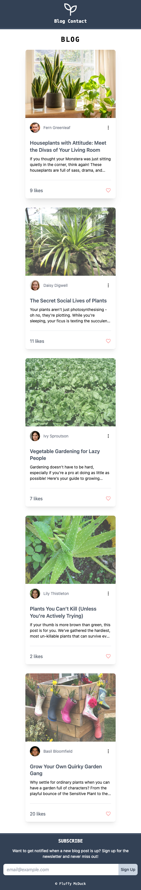
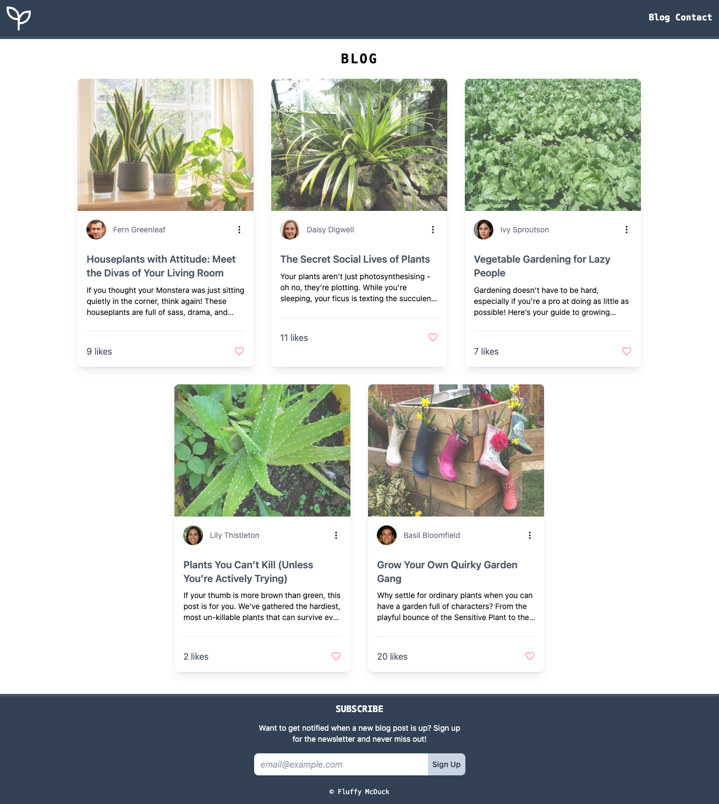

# Project Title
TailwindCSS-practiceProject

## Overview

This project is a simple blog about plants and gardening, built using Tailwind CSS. It serves as a hands-on practice project for the Scrimba CSS Tailwind course. The HTML structure is inspired by the course's example, while the CSS is written using Tailwind CSS to reinforce learning about utility-first styling and various Tailwind properties.


Below are some screenshots showcasing the design across different devices:

### 1. Mobile view


### 2. Tablet and Desktop


---

## Full Project Setup 

1. **Clone this repository:**
      ```bash
   git clone https://github.com/b-like-bahar/TailwindCSS-practiceProject.git
   
2. **Install Dependencies:**


Navigate to the project folder and install the required dependencies:
      ```bash
   cd TailwindCSS-practiceProject
   npm install

3. **Start Development:**

To preview the website, you can use the Go Live extension in VS Code (or any other local server tool). For live editing of Tailwind CSS, run the following command:
      ```bash
   npm run build:css


4. **Viewing the Website:**

Once the build is running, open the project in your browser. If you're using VS Code, you can use the Go Live extension for an easy local server. Alternatively, you can open index.html directly in your browser.

---

## Additional Information:

This project is mainly for educational purposes, to practice using Tailwind CSS for responsive design.